# 📚 Scalable 3-Tier Web Application on AWS

> A full-stack **Book Review Application** built with **Next.js, Node.js, Express, and MySQL**, deployed on AWS using a three-tier architecture.

<!-- Tech Stack Badges Section -->
## 🛠️ Tech Stack & Services


---

## 📐 Architecture Overview

The application is divided into three tiers:

- **Presentation Tier (Frontend):** Public-facing layer where the Next.js frontend runs on Amazon EC2. External HTTP traffic is received through the **Application Load Balancer (ALB)**.

- **Application Tier (Backend):** Private layer where the Node.js/Express backend runs on Amazon EC2. API requests are forwarded to the backend through the **Application Load Balancer (ALB)**.

- **Database Tier (Storage):** Private database layer using **Amazon RDS for MySQL**. It stores application data and can be accessed only by the Application Tier.

<p align="center">
  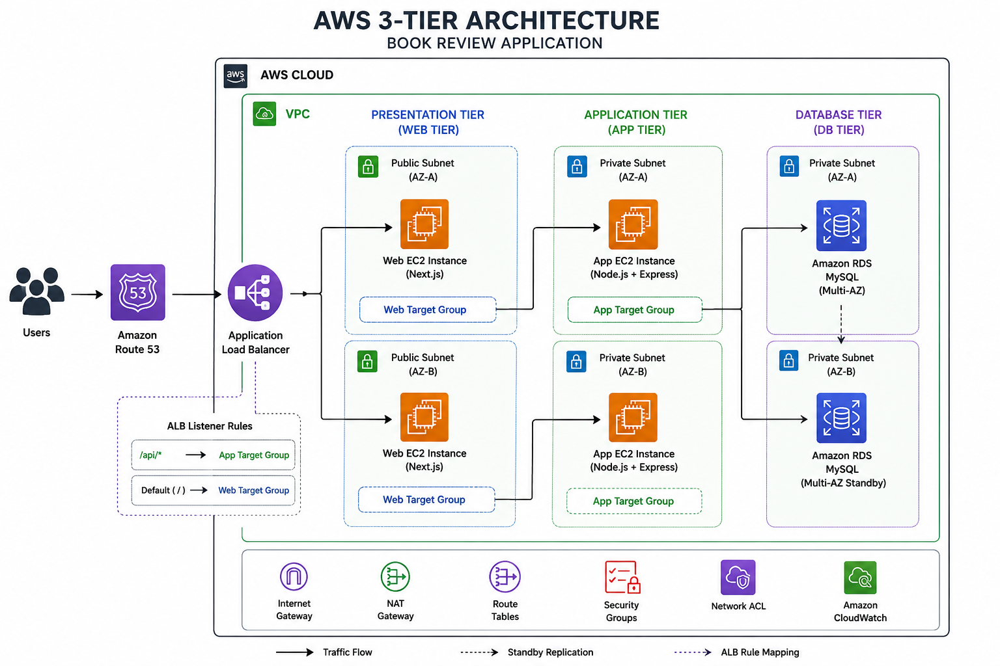
  <br>
  <em>Figure: High-Level AWS 3-Tier Architecture Diagram</em>
</p>

---

## 🛠️ Step-by-Step Implementation & Proofs

This section shows the main AWS setup steps used to deploy the Book Review Application:

### 1. Networking Setup (VPC, Subnets & NAT)
Created a custom VPC with isolated Public & Private Subnets across multiple Availability Zones, configured Route Tables, Internet Gateway, and NAT Gateway for network connectivity.

<p align="center">
  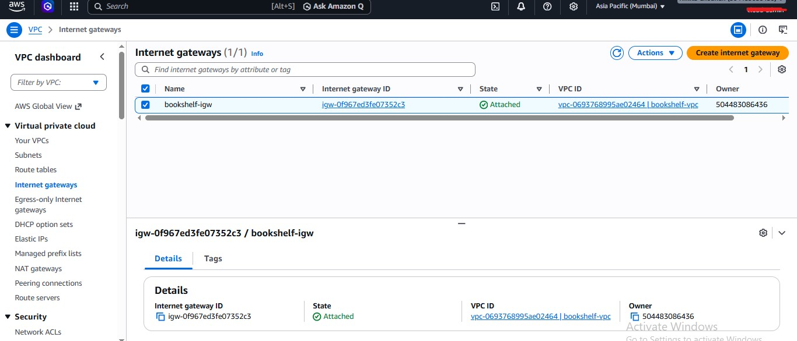
  <br><em>Figure 1.1: Custom VPC Created</em>
</p>

<p align="center">
  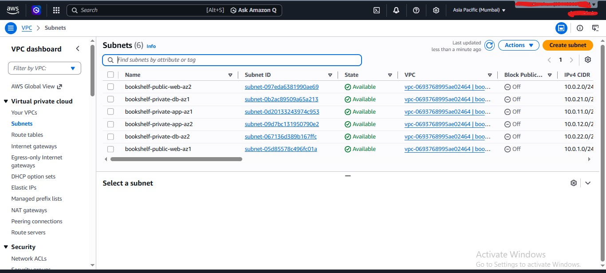
  <br><em>Figure 1.2: Public and Private Subnets Configuration</em>
</p>

<p align="center">
  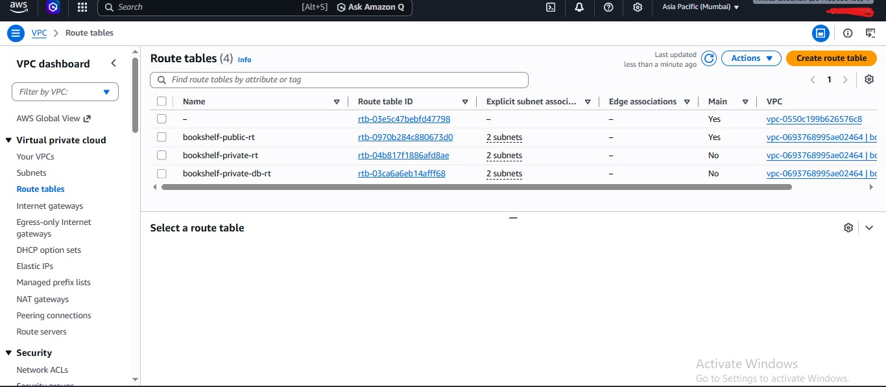
  <br><em>Figure 1.3: Custom Route Tables Configuration</em>
</p>

<p align="center">
  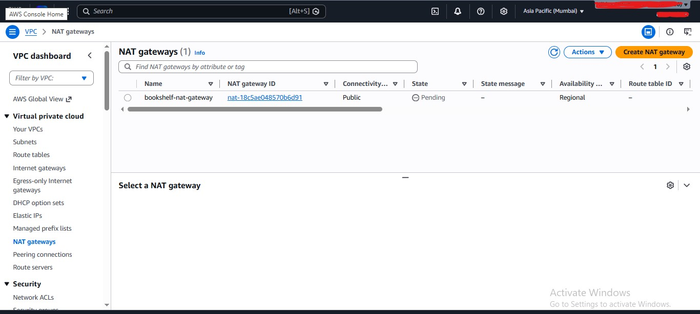
  <br><em>Figure 1.4: Active NAT Gateway in Public Subnet</em>
</p>

---

### 2. Security Configuration (Security Groups)
Configured Security Groups for the Web, App, and Database tiers to control traffic between the different layers.

<p align="center">
  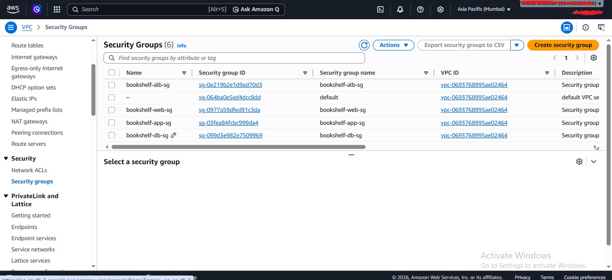
  <br><em>Figure 2.1: Custom Security Groups Setup</em>
</p>

---

### 3. Compute Layer (EC2 & Application Setup)
Created separate EC2 instances for the Web and Application tiers and deployed the application code from GitHub.

<p align="center">
  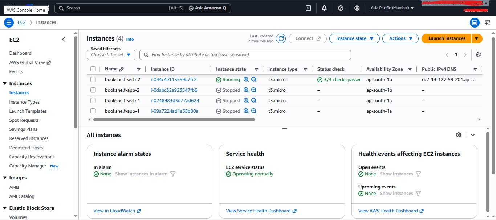
  <br><em>Figure 3.1: Active EC2 Instances Running</em>
</p>

<p align="center">
  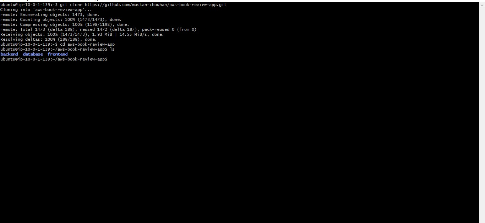
  <br><em>Figure 3.2: Cloned Project Repository on EC2 via Terminal</em>
</p>

---

### 4. Database Layer (Amazon RDS MySQL)
Created an Amazon RDS MySQL database and connected it with the Application tier using the MySQL client.

<p align="center">
  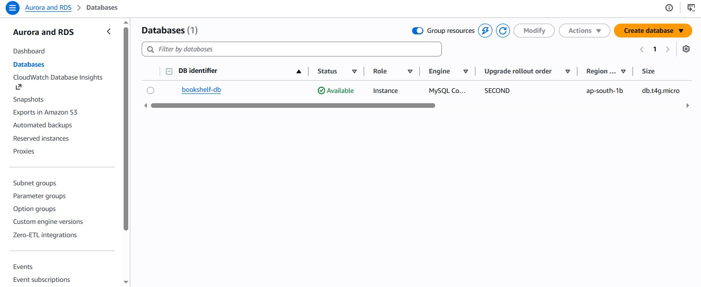
  <br>
  <em>Figure 4.1: Amazon RDS MySQL Database Created</em>
</p>

<p align="center">
  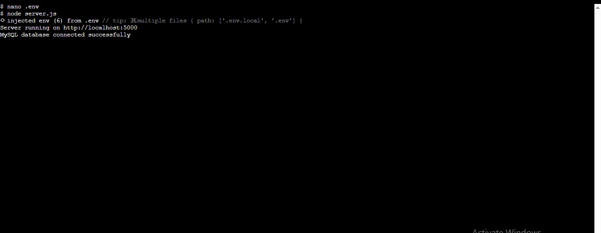
  <br>
  <em>Figure 4.2: RDS MySQL Database Connection via Terminal</em>
</p>

---

### 5. Load Balancing (Application Load Balancer)
Configured Application Load Balancer (ALB) to distribute incoming traffic smoothly across application instances.

<p align="center">
  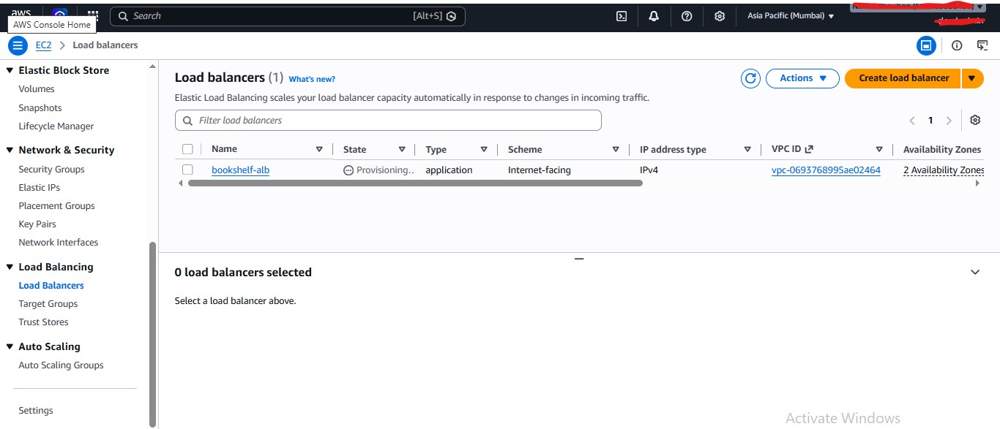
  <br><em>Figure 5.1: Active ALB Setup in Public Subnet</em>
</p>

---

### 6. Final Application Deployment
The Book Review Application is successfully deployed and accessible through the Application Load Balancer DNS.

<p align="center">
  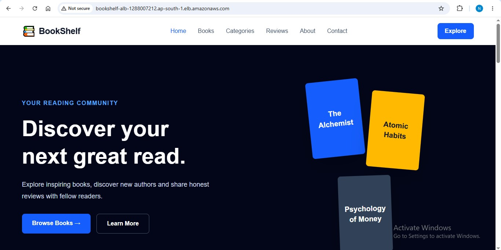
  <br>
  <em>Figure 6.1: Live Book Review Application</em>
</p>

---

## 🚀 Deployment & Server Configuration

The application was deployed on AWS using separate EC2 instances for the Web and Application tiers.

### Web EC2
The Web EC2 instance is used to run the Next.js frontend.
- Next.js is used for the frontend.
- Nginx is used to handle web traffic.
- PM2 is used to keep the application running.

### App EC2
The App EC2 instance is used to run the backend API.
- Node.js runs the backend application.
- Express.js handles the API requests.
- PM2 is used to manage the backend process.
- The backend connects to Amazon RDS MySQL.

### Application Load Balancer
The Application Load Balancer receives incoming requests and sends them to the correct Target Group.

```text
Normal Request → Web Target Group → Web EC2

/api/* Request → App Target Group → App EC2
```

---

## 🐛 Challenges Faced & Solutions

### 1. SSH Connection Timeout

**Problem:**  
While connecting to the Web EC2 instance through SSH, the connection was timing out even though the EC2 instance was running.

**Troubleshooting:**

- Verified that the EC2 instance was running.
- Checked the Security Group and SSH port 22 rule.
- Verified the public IPv4 address of the EC2 instance.
- Checked whether the SSH service was running on the instance.
- Verified that SSH was listening on port 22.
- Used AWS Systems Manager Session Manager to access the instance and troubleshoot the issue.

**Solution:**  
The SSH service was confirmed to be active and listening on port 22. The network and Security Group configuration were checked to identify the connectivity issue.


### 2. Application Load Balancer Routing

**Problem:**  
The application needed to handle both frontend requests and API requests through the same Application Load Balancer.

**Troubleshooting:**

- Configured a Target Group for the Web EC2 instance.
- Configured a separate Target Group for the App EC2 instance.
- Added an ALB rule for `/api/*` requests.
- Verified that normal requests were forwarded to the Web Target Group.
- Verified that API requests were forwarded to the App Target Group.
- Tested the application using the ALB DNS.

**Solution:**  
The ALB was configured to route requests to the correct tier based on the request path.

```text
Normal Request → ALB → Web Target Group → Web EC2

/api/* Request → ALB → App Target Group → App EC2
```


### 3. Environment Variable & API Configuration

**Problem:**  
The frontend and backend needed the correct environment variables to communicate with the database and API through the AWS deployment setup.


**Troubleshooting:**

- Configured database connection variables on the backend.
- Verified the RDS endpoint, database name, username, password, and port.
- Configured the frontend API URL using the Application Load Balancer DNS.
- Verified that API requests were sent through the ALB.
- Checked the `/api/*` routing between the frontend and Application tier.

**Solution:**  
The required environment variables were configured for the frontend and backend, allowing the application to communicate with the backend API and Amazon RDS MySQL.


### 4. Application Process & Web Server Configuration

**Problem:**  
The frontend and backend applications needed to keep running continuously on the EC2 instances and handle incoming web traffic properly.

**Troubleshooting:**

- Configured the Next.js frontend on the Web EC2 instance.
- Configured the Node.js/Express backend on the App EC2 instance.
- Used **PM2** to manage and keep the application processes running.
- Configured **Nginx** on the Web EC2 instance to handle frontend web traffic.
- Verified that the applications were running correctly on the EC2 instances.

**Solution:**  
PM2 was used for process management, while Nginx was configured as the web server for the frontend. The applications were then connected through the Application Load Balancer.

---


## 🚀 Deployment Guide

Follow the steps below to deploy the Book Review Application on AWS using the same three-tier architecture.

### Prerequisites

Before starting, make sure you have:

- An AWS Account
- Git installed
- Node.js and npm
- MySQL client
- An AWS EC2 Key Pair
- The project repository cloned from GitHub


## 🚀 Steps

1. **Clone the Repository** – Clone the project on the EC2 instances.
2. **Create VPC & Subnets** – Configure Public and Private Subnets, Route Tables, Internet Gateway, and NAT Gateway.
3. **Configure Security Groups** – Allow required traffic between Web, App, ALB, and RDS tiers.
4. **Create RDS MySQL** – Create the database and import the required schema and tables.
5. **Setup Web EC2** – Deploy the Next.js frontend and configure Nginx and PM2.
6. **Setup App EC2** – Deploy the Node.js/Express backend and configure PM2.
7. **Configure Environment Variables** – Add RDS database details and the ALB API URL.
8. **Create Target Groups** – Create separate Web and App Target Groups.
9. **Configure ALB** – Forward normal requests to Web EC2 and `/api/*` requests to App EC2.
10. **Test the Application** – Open the ALB DNS and verify the frontend, API, and database connection.


---

## 👩‍💻 Author

**Muskan Chouhan**

Cloud & DevOps Learner | Web Developer

⭐ If you found this project useful, feel free to explore the repository and give it a star.


---